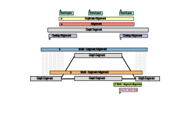

# Metagenomic assembly graph querying benchmarking sensitivity investigation
This repository accompanies the paper: Best of Both Worlds? Optimising Graph-Based Antimicrobial Resistance Gene Profiling. The following describes in more detail the methods used including metagenome simulation, assembly, and graph querying. Accompanying scripts, pipeline, and modified bioinformatics tools are included in this repository.

## Simulated dataset generation

### Simulated high complexity data 
- Based on relative abundances from [this soil metagenome](https://www.ncbi.nlm.nih.gov/sra/?term=3953912) which was found in this [Earth microbiome project affiliated paper](https://www.nature.com/articles/s41587-020-0718-6)
- Relative abundances obtained by running Bracken (v2.9) + kraken2 (v2.1.3) on the bacterial refseq database using "uniq" mode. 
- Genomes downloaded from RefSeq using NCBI datasets v15.24.0:
```
datasets download genome accession --dehydrated --inputfile to_download.tsv --filename high_complexity_assemblies.zip
```
- Simulate Long read metagenome
    - Nanosim v3.1.0 3,000,000 reads
    ```
    simulator.py metagenome -gl assembly_paths_high_nanosim_in.tsv -a abundances_high_nanosim_in.tsv -dl dna_type_high_nanosim_in.tsv -c pre-trained_models/metagenome_ERR3152364_Even/training --chimeric -t 18 --fastq -b guppy
    ```
- Simulate Short read metagenome
    - [x] InSilicoSeq v1.6.0 60,000,000 reads (~60% of the original number of reads corresponding to parokayotic content)
    ```
    iss generate --draft /data/raid1_HDD/David/graph_searching_sarand/high_complexity_assemblies/*.fna --abundance_file HC_iss_infile.tsv --model miseq --output miseq_reads --cpus 12 --n_reads 60M
    ```
### Simulated low complexity data
- Based on relative abundances from healthy 1-3 year olds from [this paper](https://www.nature.com/articles/s41522-020-00171-7). 
- Obtain accessions for each species/taxa, downloaded RefSeq assemblies from NCBI using NCBI datasets v15.24.0
- Simulate metagenomes number of reads based on (https://www.ncbi.nlm.nih.gov/pmc/articles/PMC9176275/)
    - [x] Nanosim v3.1.0 3,000,000 reads
    ```
    simulator.py metagenome -gl assembly_paths_nanosim_in.tsv -a abundances_nanosim_in.tsv -dl dna_type_nanosim_in.tsv -c pre-trained_models/metagenome_ERR3152364_Even/training --chimeric -t 18 --fastq -b guppy
    ```
    - InSilicoSeq v1.6.0 30,000,000 reads (same as original genome)
    ```
    iss generate --draft /data/raid1_HDD/David/graph_searching_sarand/low_complexity_assemblies/*.fna --abundance_file abundances_in.tsv --model miseq --output miseq_reads --cpus 12 --n_reads 30M
    ```
### Real data [ZymoBIOMICS microbial community standards](https://academic.oup.com/gigascience/article/8/5/giz043/5486468)
- Short reads of individual genomes exist in the SRA.
- Short read mi-seq metagenome: ERR2984773
- Long read GridIon metagenome: ERR3152364

### Simulated mobile element data
- Same taxa and mobile elemnts as [this metagenomic assembly paper](https://www.ncbi.nlm.nih.gov/pmc/articles/PMC7660262/)
- Simulated using InSilicoSeq v1.6.0 at 30M reads (same as in original paper) and Nanosim (3M reads) as above.

### Baseline ground truth
- To know the ground truth of which AMR genes are present in the datasets, RGI v5.2.0 was run on the assemblies used to simulate the metagenomes.
- See ```shell_scripts/rgi.sh``` and ```shell_scripts/concat.sh``` to concatenate the results into a single file.

## Process reads and generate graphs 
- Run fastp v0.23.4 on short reads for all data sets.
```
fastp -i ERR2984773_1.fastq -I ERR2984773_2.fastq -o ERR2984773_fastp_out_1.fastq -O ERR2984773_fastp_out_2.fastq
```
- Run filtlong v0.2.1 on long reads for all data sets.
```
filtlong --min_length 1000 --keep_percent 90 simulated_sample0_aligned_reads.fastq > simulated_sample0_aligned_reads_filtlong_out.fastq
```
- Assemble reads using:
    - SPAdes v3.15.5 ran in metagenome mode. See ```shell_scripts/meta_spades_run.sh```
    - Flye v2.9.2 ran in metagenome mode with --nano-corr option for pre-corrected nanopore reads. See ```shell_scripts/metaflye.sh```
    - Megahit v1.2.9 with the megahit fastg graph generation command on the largest (k=141) k-mer iteration. See ```shell_scripts/megahit.sh```
        - fastg assembly graphs were converted to gfa format using Bandage v0.8.1. 
    - Shasta v0.12.0. See ```shell_scripts/shasta.sh```

## Graph querying
- A Nextflow (v23.10.1) pipeline was used to run the graph querying tools on the assembly graphs.
- Pipelines for each tool were run individually without parallelism to assess computational performance (runtime, peak RSS) of the complete read depth datasets. 
- Conda environments were used to install the tools where possible, yaml files included. 
- A pipeline that runs all tools in parallel was used to query the subsampled read datasets. 
    - See ```all_tools/all_tools.nf```
- Note: If using any of the nextflow pipelines in this repo ensure correct paths are given for all input files. 

### Bandage
- Bandage v0.8.1 was used to query the assembly graphs.
- CARD v3.2.8 protein homolog model AMR genes were used as queries.
- See ```bandage/bandage.nf```

### GraphAligner
- GraphAligner v1.0.17b was used to query the assembly graphs.
- CARD v3.2.8 protein homolog model AMR genes were used as queries.
- See ```graphaligner/graphaligner.nf```

### SPAligner
- SPAligner, a submodule of SPAdes v3.15.5, was used to query the assembly graphs.
- CARD v3.2.8 protein homolog model AMR genes converted to .fastq format were used as queries.
- fasta files were converted to fastq format using Biopython (v1.83)
- SPAligner requires a yaml config file specifying tool parameters.
- See ```spaligner/spaligner.nf```

### Minigraph
- Minigraph v0.2.0 was used to query the assembly graphs.
- CARD v3.2.8 protein homolog model AMR genes were used as queries.
- Minigraph does not support sequence graphs with overlapping segments. To remove overlaps in teh SPAdes and Megahit assembly graphs, Unicycler was adapted and used. 
- The Unicycler v0.5.0 function ```remove_all_overlaps()``` was modified to avoid trimming segments to a length of 0 and was implemented in ```remove_overlaps.py```. 
- To install run ```python3 setup.py install``` in the ```minigraph/Unicycler``` directory as described in the [Unicycler documentation](https://github.com/rrwick/Unicycler).
- See ```minigraph/minigraph.nf```

### Bifrost 
- Bifrost v1.3.0 was used to query the assembly graphs with the -P setting to output the ratio of found k-mers 
- CARD v3.2.8 protein homolog model AMR genes were used as queries.
- Natively, Bifrost does not locate the position of the k-mer matches in the graph; however, this information is identified as part of the Bifrost UnitigMap data structure.
- Search.tcc was modified in Bifrost to output the first k-mer of the unitig (segment) containing the pseudoalignemnt as well as the first k-mer of the query sequence.
- These k-mers are writted out during the verbose output of Bifrost. 
- Bifrost requires all .gfa files to have the standard [gfa format header](https://gfa-spec.github.io/GFA-spec/GFA1.html). These were added to gfa files that do not have them (e.g. SPAdes). 
- To install the modified Bifrost found in ```location_bifrost/bifrost``` install from source as described in the [Bifrost documentation](https://github.com/pmelsted/bifrost)
- See ```location_bifrost/uni-bifrost.nf```

### Pathracer
- Pathracer v3.16.0 was used to query the assembly graphs following the authors implementation in [graphamr](https://github.com/ablab/graphamr) which includes ORF identification followed by an RGI search of the ORFs.
- Pathracer requires HMMs as input to be used as queries.
- CARD v3.2.8 protein homolog model AMR gene families were subclustered at 90% amino acid identity using MMseqs2 v15.6 as not all AMR gene families are homologous. 
    - See ```shell_scripts/mmseqs_clust.sh```
- These family clusters were then aligned with Muscle v5.1 and HMMs were built using HMMER v3.4.
    - See ```shell_scripts/muscle.sh``` and ```shell_scripts/hmmbuild.sh```
- See ```pathracer/pathracer.nf```

### RGI run on metagenomic contigs
- To assess the relative sensitivity of the graph querying tools, RGI v5.2.0 was run on the metagenomic contigs using CARD v3.2.8 protein homolog model AMR genes.
    - See ```shell_scripts/rgi.sh``` and ```shell_scripts/concat.sh``` to concatenate the results into a single file.

### Read mapping analyses
- To put graph querying precision and recall in the context of read mapping RGI-BWT (for short reads) and minimap (for long reads) were used to map reads to the CARD v3.2.8 protein homolog model AMR genes.
- Note: Read mapping does not allow for genomic context investigation as graph querying and contig analysis do.
    - See ```shell_scripts/rgi_bwt.sh``` and ```shell_scripts/minimap.sh```
- Minimap output was processed using samtools to calculate coverage
    - See ```shell_scripts/samtools_coverage.sh```

## Output processing

### Combining results and bug fixing
- The following scripts are written in R and are designed to be run in RStudio. If you decide to use any of these scripts, ensure file paths are correct for data input and output.
- The outputs of each graph querying tool and read analyses need to be processed before they can be compared with one another.
- First, the outputs for each dataset and subsample need to be combined in a single file.
- Additionally, SPAligner has various bugs that obsecure the location of an alignment in the graph. These must be corrected before proceeding. 
    - See ```R_data_analysis_visualisation/combine_subsampled_data.R```

### Determining the best hit per locus
- Aside from Pathracer, no other tool identifies an ORF and assigns a single best hit to that locus. 
- CARD is a redundant database inthe sense that very similar sequences are present in the database. These homologous sequences will all align to a single region in the graph and the best one must be selected for each locus. 
- Figure S6 described how in this study we have defined a hit locus in the context of a graph and assigned the best hit to that locus. 

- Once each alignment has been assigned a hit locus, the hit with the longest query coverage and best percent identity is selected as the best hit for that locus.
- To assign hit loci to all alignment we use a brute force strategy that searches all alignments against all alignments. If using a dataset of similar size to this study expect this script to take a long time. If run in parallel for each tool, expect ~50 hours on a M1 Macbook Pro. 
- See ```R_data_analysis_visualisation/subsampled_hit_region.R```

## Calculating precision and recall
- In this study we calculated precision and recall for both the binary presence/absense of the AMR gene/family cluster as well as the quantity of the AMR gene/family cluster as some AMR genes are present more than once in the datasets. 
- As explained in the paper, we chose to focus on the binary results as assembly graphs collapse repeated sequence into single segments/unitigs making coverage a better metric for gene quantity. 
- The optimal percent identity and query coverage thresholds for each tool and dataset were also determined and used in the final figures. These thresholds can inform useres of these tools as to which thresholds may be appropriate for their tool and dataset complexity. 

### read precision and recall
- read precision and recall were calculated for each dataset separately as there are fewer datsets because they are not yet assembled by multiple assemblers. 
- The outputs are used in the following R scipts 
- For gene level precision and recall see ```R_data_analysis_visualisation/read_analyses.R```
- For family cluster level precision and recall see ```R_data_analysis_visualisation/read_family_analyses.R```

### Binary
- To calculate precision and recall for each dataset of AMR gene presence/absense generating Figures 1 and 3 see ```R_data_analysis_visualisation/binary_accuracy.R```
- To calculate precision and recall for each dataset of AMR gene family cluster presence/absense generating Figure 2 see ```R_data_analysis_visualisation/binary_accuracy_family.R```

### Quantity
- To calculate precision and recall for each dataset of AMR gene quantity generating Figure S4 see ```R_data_analysis_visualisation/accuracy.R```
- To calculate precision and recall for each dataset of AMR gene family cluster quantity generating Figure S5 see ```R_data_analysis_visualisation/accuracy_family.R```

### Combining graph querying and contig querying
- To combine the results of the graph querying tools (graphaligner in our case) with contig querying generating Figure 4 see ```R_data_analysis_visualisation/contig_graph_combo.R```

### Examining which tool finds the most multi-segment hits
- To examine which tool finds the most multi-segment hits generating Figure S3 see ```R_data_analysis_visualisation/multi-seg_hits.R```

## Computational performance
- To generate figure S1 and figure S2 describing the log10 runtimes and the peak RSS for each tool see ```R_data_analysis_visualisation/comp_resources.R```
- Nextflow was used to measure these metrics for each tool. 